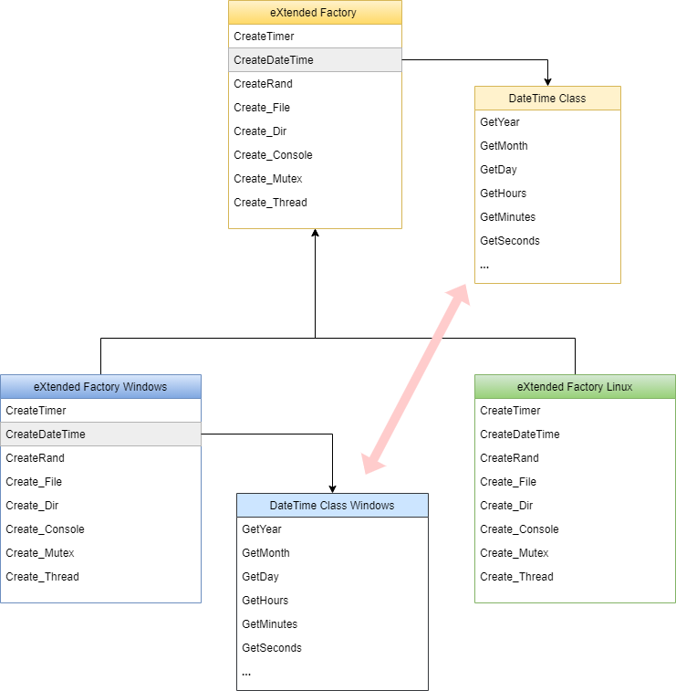

# Introducción al GEN FrameWork 

Introducción
---------------

Un Framework sirve para poder escribir código o desarrollar una aplicación de
manera más sencilla. Es algo que permite una mejor organización y control de
todo el código elaborado, así como una posible reutilización en el futuro.
Debido a esto, garantiza una mayor productividad que los métodos más
convencionales y una minimización del coste al agilizar las horas de trabajo
volcadas en el desarrollo.

Por otra parte, su acción es algo que afecta también a los errores,
minimizándolos considerablemente. En definitiva, es algo que brinda una ayuda
general y más que considerable al programador y desarrollador, haciendo que sus
labores sean mucho más sencillas.

La idea de básica del desarrollo del GEN es su uso para un entorno GENERALISTA:
Debe servir para desarrollar cualquier tipo de aplicación tanto de entornos de
consola, como gráficos.

Características
---------------

Para su uso extensivo el framework **debe ser multiplataforma**: Esto permitir
hacer aplicaciones para diferentes S.O o dispositivos. Esta característica
además debe ser **“simultanea”**. Debe permitir compilar la misma aplicación,
sin necesidad de cambiar o configurar nada para cada plataforma.

La característica de multiplataforma simultanea permite, además:

-   Desarrollar en una plataforma diferente a la del destino: Por herramientas
    disponibles o por el entorno instalado en la empresa que desarrolla la
    aplicación.

-   No es necesario, en un principio, disponer de la plataforma de destino: No
    es necesario disponer del hardware/software (S.O) para comenzar el
    desarrollo.

-   No es necesario tener conocimientos de la plataforma destino. No es
    necesario conocer APIs o funcionalidad del S.O o dispositivo de destino. El
    framework aísla y soporta uniformemente esas dependencias.

También cuenta con beneficios añadidos:

-   Al compilar la aplicación con varios compiladores y entornos, el código a
    nivel de sintaxis está mucho más comprobado.

-   Se pueden utilizar las herramientas de depuración: Debuggers, Analizadores
    de código o simuladores de cualquiera de las plataformas soportadas.

Para mantener la multiplataforma es necesario que las dependencias dentro el
propio framework este cuidadosamente seleccionadas y deben estar, siempre que
fuera posible, disponibles en fuentes (para ser compiladas con el propio
framework y la aplicación.

El lenguaje de programación seleccionado para desarrollar el framework es C++-

**¿Por qué?**

-   Es un lenguaje de programación orientada a objetos (**O**bject **O**riented
    **P**rogramming: OOP). El paradigma de programación orientada a objetos
    permite que la reutilización del código sea mucho más amplia y comoda tanto
    para las aplicaciones desarrolladas, como la reutilización realizada dentro
    del mismo framework.

-   Está disponible en todas las plataformas. Hay compiladores y herramientas de
    C/C++ prácticamente para cualquier plataforma a diferencia de (C\#, Java,
    etc.).

(Incluimos a los microcontroladores en esa disponibilidad.)

-   Debe permitir el acceso a todos los recursos de la plataforma: Memoria,
    hardware disponible (Displays, Wifi, USB, Bluetooth, GPIOs, u otros tipos de
    interfaces).

-   Debe tener gran rendimiento. El echo de que C/C++ sea compilado a código
    maquina final de la plataforma y no a un código intermedio como el Byte Run
    Code (Java) o el CLR (Common Language Runtime) de C\#, permite que la
    aplicación tenga un rendimiento más alto.

-   Mas disponibilidad de librerías de terceros (en fuente) para su integración
    con el framework tanto en lenguaje C como en C++. Ejemplos (compresión ZIP,
    Gráficos JPG/PNG, Acceso a Base de datos: Postgres/ MySQL, etc.

Todo el Framework se distribuye en fuentes, las dependencias de este también,
por lo menos en su gran mayoría (un 90%).

*(Existen algunas librerías de cliente como las de base de datos que no pueden
usarse así y son cargadas como librerías compiladas)*

Asunciones dentro del framework
-------------------------------

Existen una serie de asunciones dentro del framework que deben ser tenidas en
cuenta.

-   El framework esta en constante evolución. Tiene baste trabajo desarrollado,
    pero hay partes que se van ampliando e implementando.

-   Las relaciones de todos los ficheros/directorios son relativas dentro del
    Framework, por lo que es muy aconsejable mantener la estructura y nombres de
    archivos.

-   Todos los nombres de archivos son consistentes. Los módulos se llaman igual
    que la clase principal que contienen.

-   Se suele mantener el uso de una clase por modulo. Solo se rompe esta regla
    si existen clases auxiliares a la principal.

-   Se escriben todas las clases, nombre de variables, módulos, etc. en ingles.
    ¿Por qué? Por coherencia con el lenguaje C/C++, es mas corto y “suena a más
    importante” .

-   Todos los módulos tienen su propio header, con el mismo nombre que el módulo
    al que pertenecen.

-   Solo se usan las extensiones (.h), (.c) y (.cpp). No se usan ni (.hpp) ni
    (.c++).

-   El framework intenta maximizar la compatibilidad con la plataforma
    selecionada a si con el compilador usado, por lo que usa en la mayor parte
    características de C89.

Funcionalidad ofertada
----------------------

Como hemos comentado, el framework GEN esta desarrollado para realizar
aplicaciones “generales”, porque tiene que ofertar la funcionalidad más amplia
posible:

### Utilidades 

-   Control y detección del S.O (versión, nivel batería, versión del S.O).

-   Strings. (incluido Unicode).

-   Gestión de Buffers (incluido nivel de Bits).

-   Mapas, Vectores, Listas, Diccionarios, Trees.

-   Enumeración de directorios y ficheros, acceso a ficheros varios formatos:

    -   TXT Texto. Texto incluyendo Unicode y Control BOM (Byte Order Mark)

    -   CSV Texto. Coma separated Value.

    -   DBF Binario. DBase IV.

    -   DFU Binario. Archivo de firmware.

    -   HEX Texto. Archivo de firmware.

    -   RIFF Binario. Archivo de media (usado por Microsoft)

    -   XML Texto. Formato de datos en árbol.

    -   JSON Texto. Formato de datos en árbol de JavaScript.

    -   INI Texto. Archivo de configuración

-   Creación de Log.

-   Traducciones de lenguaje.

-   Ficheros de configuración.

-   Control de Date/Time.

-   Control de Consola.

-   Threads/Mutex Normales y No preventivos + gestión en colecciones.

-   Creación de Timers.

-   Funciones de Delays.

-   Sheduler con creación de tareas temporizadas y/o cíclicas.

-   Tipo de variable múltiple: Variant.

-   Creación de Publisher con Eventos y Observadores.

-   Funciones de Random.

-   Funciones de ejecución de tareas externas con control de entras salidas.

-   Control de memoria compartida (para comunicación entre aplicaciones
    locales).

-   Control de Paths y funciones de Path.

-   Funciones de Trazas, remota y local (con servidor dedicado).

### Comunicaciones

-   Capacidad de funcionar con diferentes conectividades (TCP/IP, UDP, USB,
    UART, Wifi, Bluetooth, I2C, SPI, etc.).

-   Diferentes protocolos (HTTP, DNS, NTP, Mod-Bus, Ping, SNMP, ICMP, etc.).

-   Enumeración de conectividades tanto remota como local.

-   Web Server con Web Socket, PHP y API Rest.

-   Soporte para Web Client con conexiones HTTP.

-   Creación de protocolos propietarios binarios (conexiones activas y con
    posibilidad de encriptación).

-   Creación de protocolo propietario de texto (CLI).

-   Gestión de Comandos AT (incluido los de GSM).

-   Sistema de alertas por diferentes medios (UDP, email, Web, etc.)

-   Gestión TLS (en desarrollo).

-   Soporte para Displays LCD, OLED.

-   Soporte para LED NEOPIXEL.

-   Soporte para gestión de GPIO en varios formatos y con mapeado.

-   Soporte para la NCAP (captura en modo promiscuo de ICMP, UDP y TCPIP).

-   Soporte para protocolo OBEX.

-   Soporte para Wake ON Lan.

-   Drives para diferentes sensores en I2C y SPI.

-   Funciones Web Scraper mediante fichero de configuración: IP Publica,
    geolocalización IP, MAC manufactured, etc.

### Inputs

-   Control de diferentes dispositivos de entrada: Teclado, ratón, Pantallas
    táctiles, Wii-Mote.

-   Control de Cursores y Botones para desacoplar gestión de entrada.

-   Gestión de Motilón para pantalla táctil.

### Encriptación

-   Funciones HASH de autentificación con: CRC16, CRC32, CKS16, MD5, SHA1, SHA2,
    COM128v1, Whirlpool.

-   Funciones de encriptación simétricas: DES, 3DES, AES y Blowfish.

-   Funciones de encriptación asimétricas: RSA.

### Compresión

-   Compresión en buffer en formato: GZ, LZW, LZRW1KH y ZIP.

-   Gestión de ficheros ZIP: Crear, Descomprimir y añadir.

### Databases

-   Conector para bases de tipo SQL. Creación, borrado, escritura y lectura de
    tablas, envió de Querys. Valido para:

    -   PostgreSQL.

    -   MySQL / MariaSQL.

    -   SQLite.

### Script

-   Gestión de Scripts para tres lenguajes: G, JavaScript y Lua: con ejecución
    de los scripts y control de errores.

-   Gestión de librerías para enlace con el resto del framework.

### Sound 

-   Gestión de reproducción de sonidos para ficheros y ondas: Soporte de
    Windows, Linux y Android.

-   Formato de ficheros soportados WAV y OGG.

### Gráficos

Es el conjunto de funciones para realizar gráficos en el framework.

-   Soporte para Canvas 2D. De momento el soporte 3D esta desactivado.

    -   Canvas 2D FrameBuffer para Windows, Linux, X11 + Display LCD (SPI y
        I2C).

    -   Canvas con primitivas graficas: líneas, Rectángulos, Círculos, elipses,
        etc. (con relleno, anti-aliasing y outline).

    -   Soporte de Sprites.

    -   Soporte para zonas de redibujado + ViewPorts.

-   Soporte para ficheros gráficos: JPG, PNG, TGA y BMP.

-   Gestión de FrameRate.

-   Gestión de Fonts: Bitmap y vectoriales (TrueType y Freefont).

### Interfaz de Usuario

Permite la realización de Interfaces de usuario para las aplicaciones. Se basa
en las funciones de Gráficos del propio framework

-   Soporte para Canvas con Skins.

-   Maquetación de formato mediante fichero XML.

-   Elementos de Interfaz soportados (por el momento).

    -   Etiqueta de Texto

    -   TextBox

    -   Imagen

    -   animación

    -   Opción

    -   Multiopcion (con animaciones y texto)

    -   Boton

    -   CheckBox

    -   Edicion de Texto

    -   Forms

    -   Menu

    -   ListBox

    -   Progress Bar

Organización de Directorios/Repositorios
----------------------------------------

Todo el framework se encuentra en un único directorio.

La estructura básica de directorios es:

**[GENFrameWork]**

**[Documents]** Directorio con documentación

**[Examples]** Directorio con ejemplos y pruebas unitarias.

>   **[GEN]** Directorio con las fuentes del framework y configuraciones de
>   CMake.

**[Resources]** Directorio con iconos/Logos, Script, Config WebScraper.

**[ThirdPartyLibraries]** Directorio de librerías de terceros.

>   **[Utils]** Directorio con utilidades Extra: Servidor de Traceo, Macros y
>   Creador de actualizaciones.

Cada directorio es un repositorio disponible en el Git-Lab:

>   <http://gitlab.dyndns.org/genframework>

**GENFrameWork** es nombre del Grupo del mismo acceso.

Se recomienda mantener la estructura de directorios como la representada para
mantener la coherencia en los proyectos de ejemplos y la localización de los
módulos de C++. Por lo que se debe bajar los repositorios en dicha estructura.

Los directorios mínimos para poder trabajar son el **[GEN]** y el
**[ThirdPartyLibraries]** los demás directorios/repositorios son opcionales,
pero muy recomendados.

### Directorios dentro de cada repositorio 

**[Documents]**

Es el directorio de con la documentación del GEN. Contiene de momento algunas
guías de compilación y listas de recursos a compilar. También contiene un
fichero de configuración del Doxygen:

<https://www.doxygen.nl/index.htmlDOxyfile>.

Mediante el fichero (Doxyfile) y la aplicación Doxygen se puede generar la
información de documentación y jerarquías del propio código fuente del frame
work.

**[Examples]**

Directorio de ejemplos y test unitarios del Framework.

**[Base]**

>   Ejemplos básicos (sin aplicación) validos para compilar en las plataformas
>   mas pequeñas (microcontroladores).

>   **[NoApp]** Ejemplo mínimo de funcionamiento del framework

>   **[TestDataIO]** Test unitario + ejemplo de comunicaciones GPIO, UART, I2C,
>   SPI, USB y neopixel.

>   **[Canvas2DDisplay]** Ejemplo de gráficos para displays LCD.

**[Console]**

>   Ejemplos con salida a consola + aplicación (validos para Windows + Linux
>   normalmente).

>   **[BinConnPro]** Ejemplo de realización de protocolo binario, con
>   mantenimiento de conexiones (incluido cliente / servidor).

>   **[Databases]** Ejemplo conector para bases de datos SQL (Postgress, MySQL,
>   SQLite).

>   **[MiniWebServer]** Ejemplo de servidor Web con soporte para PHP y
>   websocket.

>   **[Scripts]** Ejemplo de ejecución de Script (G, Lua, JavaScript).

>   **[Tests]** Test unitario + Ejemplo de varias funcionalidades del framework.

**[Graphics]**

Ejemplos de aplicación para modo Grafico (Validos para Windows, Linux y
Android).

**[Canvas2D]** Ejemplo de aplicación grafica con sprites.

>   **[UI_Options]** Test Unitario más ejemplos de la interfaz gráficos de
>   usuario.

**[GEN]**

Directorio de fuentes principal.

>   **[Application]** Módulos de la aplicación (generación de aplicaciones con
>   el GEN).

**[Cipher]** Módulos de encriptación / Hash**.**

>   **[Common]** Módulos comunes de configuración (Defines + Macros).

>   **[Databases]** Módulos para el conector de bases de datos.

>   **[DataIO]** Módulos de comunicaciones.

>   Factory Data Input/output.

>   **[Graphics]** Módulos de gráficos.

>   Factory Graphics.

>   **[Input]** Módulos de control de entradas (Teclado, ratón, etc.).

>   Factory Input.

>   **[MainProc]** Módulos con el Main principal.

>   **[Media]** Módulos de reproducción de media (de momento desactivado).

>   **[Platforms]** Módulos de la plataforma (Windows, Linux, Android, STM32).

>   Todos los factorys.

>   **[Script]** Módulos de Script + Librerias para los Scripts.

>   **[Sound]** Módulos de control de sonido (parte desactivado por el momento)

>   Factory Sound.

>   **[UserInterface]** Módulos de interfaz de usuario.

>   **[Utils]** Módulos de utilidades.

>   Factory eXtended.

**[Resources]**

Recursos de propio framework.

**[Logos]** Imágenes y logos del framework.

**[scripts]** Scripts de ejemplos.

>   **[webscraper]** Ejemplos de configuración para módulos de WebScraper.

**[ThirdPartyLibraries]**

Librerias de Terceros usandos en el frameWork.

>   **[agg]** Librería AGG (Anti-Grain Geometry) para gráficos Camvas.

>   **[Android-ndk]** NDK (Native Develop Kit) de Android.

>   **[duktape]** Interprete de JavaScript.

>   **[ffmpeg]** Librería de MPEG. (De momento desactivado).

>   **[glew]** Ficheros de OpenGL (3D) para GLUT. De momento desactivado)

>   **[InpOutBinaries]** Libreria de GPIO para puerta paralelo en Windows.

>   **[jpeglib]** Librería para compresión/descompresión de JPG (Joint
>   Photographic Experts Group)

>   **[libpcap]** Librería PCAP para modo promiscuo de conexión.

>   **[libpng]** Librería para descompresión de ficheros PNG (Portable Graphics
>   Format).

>   **[lua]** Librería de interpretación para el script de LUA.

>   **[mysql-connector-c]** Librería de conector para MySQL / MariaSQL.

>   **[OpenAL]** Librería de Sonido OpenAL.

>   **[OpenGL-Registry]** Modulo de defines para OpenGL (De momento
>   desactivado).

>   **[postgresql]** Librería de conector para PostgreSQL.

>   **[sqlite]** Librería de conector para SQLite.

>   **[StackWalker]** Librería para control de debug Windows.

>   **[stb]** Librería para ficheros Orbis de sonido. Formato OGG.

>   **[Toast++]** Librería para notificaciones en Windows.

>   **[zlib]** Librería para compresión/descompresión ZIP.

**[Utils]**

Aplicaciones de Utilidades para el framework.

>   **[APPUpdateCreater]** Aplicación para generar registro de actualización de
>   aplicaciones para el framework.

>   **[Macros]** Macros para el Visual Studio .Net 2019, recreación de
>   comentarios en el código fuente.

>   **[XTraceMonitor]** Servidor para Trazas remotas y por serie.

Organización básica de classes, Singletons y Factorys
-----------------------------------------------------

La mayoría de la funcionalidad del FrameWork se oferta a través en de tres
formatos: Clases, Singletons y Factorys.

El soporte de la multiplataforma se realiza a través de la implementación y uso
del patrón de diseño Factory por varios bloques. Este patrón permite instanciar
una clase con interfaz genérico pero heredado de una clase más “particular”.

En el caso del framework la clase “particular” es la que contiene las funciones
propias de plataforma.

En la figura 1 vemos uno de los bloques del framework (e**X**tended
**Factory**). Este factory permite crear una serie de clases que a su vez
contienen los miembros a usar.

Cada bloque de factory es un singleton que se crea al inicio de la aplicación,
con una simple Macro se realiza el proceso de llamada y obtenemos la
funcionalidad de la plataforma, pero abstraída en la interfaz común:

En caso del ejemplo de la figura 1 usamos la macro GEN_XFACTORY para acceder al
factory eXtended y el mismo nos dará una clase sobrecargada, con interfaz común:

**XDATETIME\* datetime = GEN_XFACTORY.CreateDateTime();**

**XDWORD year = 0;**

**If(datatime) year = datetime-\>GetYear();**

**[Ejemplo 1]**

En el ejemplo anterior obtenemos el año de la fecha actual, con total
independencia de la plataforma en la que lo ejecutemos.

### Principales factorys

En framework existen 5 Factorys principales. Cada factory tiene asociadas tanto
las clases comunes, como las de plataforma. Todas ellas son Singleton y
accesibles desde cualquier parte del Framewok como de la aplicación a través de
unas macros concretas.

Todos los módulos asociados a una factoria, tienen el mismo comienzo: **X, DIO,
INP, etc.**

En el caso de los módulos de plataforma se les añade a continuación el nombre de
la plataforma en mayúsculas: **WINDOWS, LINUX, ANDROID, STM32**.

-   **Factory eXtended [XFactory]:** Esta ubicada en el directorio [Utils].
    Genera clases eXtendidas de “utilidades” concreta. Se accede mediante la
    macro **GEN_XFACTORY**.

Todos los módulos de esta factoría empiezan por la letra “**X”** (en
mayúsculas).

-   **Factory Data Input Output [DIOFactory]:** Esta ubicada en el directorio
    [DataIO]. Genera clases referentes a comunicaciones. Se accede mediante la
    macro GEN_DIOFACTORY.

Todos los módulos de esta factoria empiezan por la “**DIO**” (en mayúscula).

-   **Factory Graphic [GRPFactory]:** Esta ubicada en directorio [Graphics].
    Genera las clases relacionadas con Gráficos. Se accede mediante la macro
    **GEN_GRPFACTORY.**

Todos los módulos de esta factoría empiezan por la letra “**GRP”** (en
mayúsculas).

-   **Factory Input [INPManager]:** Esta ubicada en directorio [Input]. En Input
    hay una factoría, pero es de dispositivos [INPFactoryDevices]. Realmente el
    singleton que maneja las clases es un Manager. Se accede mediante la macro
    **GEN_INPMANAGER.**

Todos los módulos de esta factoría empiezan por la letra “**INP”** (en
mayúsculas).

-   **Factoria Graphic [SNDFactory]:** Esta ubicada en directorio [Sound].
    Genera las clases relacionadas con sonido/musica. No tiene de momento macro
    de ACCESO por que esta con cambios, aunque seguramente sera
    **GEN_SNDFACTORY.**

Todos los módulos de esta factoría empiezan por la letra “**SND”** (en
mayúsculas).

Configuración y creación de proyectos
-------------------------------------

El FrameWork todos los módulos están en fuentes. Estos módulos deben ser
agregados al proyecto del IDE/Compilador para que junto a los módulos propios de
la aplicación se pueda generar el ejecutable requerido.

### Estructura de directorios en un proyecto

La estructura de directorios recomendada para un proyecto de GEN es:

**[Proyecto]** Directorio raíz del proyecto (con el nombre del proyecto).

>   **[Applicacion]** Directorio con las fuentes de la aplicación “concreta” del
>   proyecto.

**[assets]** Directorio raíz con los posibles recursos de la aplicación.

>   **[Platforms]** Directorio con los diferentes ficheros de proyectos de cada
>   plataforma.

**[Document]** Directorio con la documentación del proyecto.

>   **[Resources]** Directorio con los recursos del proyecto (imágenes base,
>   sonidos en origen, etc.).

Los directorios imprescindibles son **[Application]**, **[assets]** y
**[Platforms]**. Opcionalmente pueden existir **[Document]** y **[Resources]**.

El directorio **[assets]** es relativo, pero en la ejecución de la aplicación es
localizado a partir de directorio del proyecto. Esto permite ejecutar la
aplicación tanto en reléase/debug sin ningún cambio. El nombre se puede cambiar,
pero por compatibilidad con Android es mejor dejar por defecto este nombre.

El directorio **[Platforms]** contiene los diferentes proyectos ordenados por
plataforma y dentro de la plataforma las posibles opciones de los binarios.

Existen dos posibles métodos para la creación de un proyecto con el GEN.

### Adición de módulos al proyecto

Consiste en simplemente añadir los módulos necesarios al proyecto del
IDE/compilador seleccionado. Esta tarea es ardua y se deben conocer las
dependencias (módulos) necesarios para cada funcionalidad.

En contra partida este método maximiza la compatibilidad con el entorno
seleccionado. Es válida para prácticamente cualquier compilador/IDE que se vaya
a utilizar.

Existe un control adicional para estas dependencias, cuando se utiliza este tipo
de gestión. Es el fichero **APP_GEN_Defines.h**

En este fichero se pueden activar y desactivar mediante gestión de
pre-compilacion, muchas las características y funcionalidades (features) del
FrameWork.

    #ifndef WINDOWS
    
    #define HW_STM32
    
    #define MICROCONTROLLER
    
    #define XTRACE_ACTIVE
    
    #define XTRACE_NOINTERNET
    
    #define XMEMORY_CONTROL_ACTIVE
    
    #define DIO_ACTIVE
    
    #define DIOGPIO_ACTIVE
    
    #define DIOUART_ACTIVE
    
    #define DIOI2C_ACTIVE
    
    #define DIOSPI_ACTIVE
    
    #define DIOLEDNEOPIXELWS2812B_ACTIVE
    
    #define APP_ACTIVE
    
    #endif

**[Ejemplo 2]**

### Uso del CMake

**CMake** originalmente fue desarrollado por Kitware en 1999 para el desarrollo
de sus herramientas de visualización 3D VTK: The Visualization Toolkit ITK: The
Insight Segmentation and Registration Toolkit.

Es una familia de herramientas multiplataforma de código abierto diseñada para
construir, probar y empaquetar software.

Se usa para controlar el proceso de compilación de software utilizando una
plataforma simple y archivos de configuración independientes del compilador, y
generar archivos de trabajo y espacios de trabajo nativos que se pueden usar en
el entorno del compilador que elija.

Está desarrollado sobre todo para su uso con C/C++ y es un equivalente a lo que
se puede utilizar en Java (Maven, Gradle).

El CMake permite generar scripts que controlan la creación de los proyectos a
compilar. Para facilitar la operación el GEN FrameWork tiene creado un fichero
de propio (en formato CMAKE **GEN_CMakeLists.txt)** que gestiona formación del
proyecto, incluyendo o excluyendo los módulos necesarios del propio framework.

La idea es simple, solo es necesario activar o desactivar las variables de
FEATURES disponibles para que los scripts del GEN generen las dependencias de
forma adecuada.

El framework usa los siguientes ficheros de Script del **CMake**:

| Nombre Script               | Descripción                                                 |
|-----------------------------|-------------------------------------------------------------|
| GEN_CMakeLists.txt          | Script general que añadir módulos al proyecto.              |
| GEN_CMakeLists_Default.txt  | Script con la inicialización de todas las FEATURES del GEN. |
| GEN_CMakeLists_Librarys.txt | Script con el control de añadir librerías al proyecto.      |
| GEN_CMakeLists_Warnings.txt | Script de control de Warnigs en el proyecto.                |

Para crear un nuevo proyecto con se genera de un fichero **CMakeLists.txt**
propio del proyecto en él se referencia las llamadas al resto de los scripts, la
activación de Features y la lista de de módulos propios del proyecto.
    
    # --------------------------------------------------------------------
    
    # testdataio : Example of console GEN FrameWork
    
    # --------------------------------------------------------------------
    
    cmake_minimum_required(VERSION 3.3.0)
    
    project(testdataio)
    
    set(GEN_DIRECTORY "../../../../../GENFrameWork")
    
    # --------------------------------------------------------------------
    
    # Activate features/Defines
    
    include("\${GEN_DIRECTORY}/GEN/GEN_CMakeLists_Default.txt")
    
    set(DEBUG_FEATURE true CACHE BOOL "Activate Debug mode" FORCE)
    
    set(XTRACE_FEATURE true CACHE BOOL "Activate XTrace" FORCE)
    
    set(XMEMORY_CONTROL_FEATURE true CACHE BOOL "Activate XMemory Control" FORCE)
    
    set(DIO_FEATURE true CACHE BOOL "Activate Data Input/Output" FORCE)
    
    set(DIO_STREAM_FEATURE true CACHE BOOL "Activate Data Input/Output Stream"
    FORCE)
    
    set(DIO_STREAMUART_FEATURE true CACHE BOOL "Activate Data Input/Output Stream
    UART" FORCE)
    
    set(DIO_STREAMUSB_FEATURE true CACHE BOOL "Activate Data Input/Output Stream
    USB" FORCE)
    
    set(DIO_GPIO_FEATURE true CACHE BOOL "Activate GPIO" FORCE)
    
    #set(DIO_GPIO_PCPARALLEL_FEATURE true CACHE BOOL "Activate Data Input/Output
    GPIO PC Parallel" FORCE)
    
    set(DIO_STREAMI2C_FEATURE true CACHE BOOL "Activate Data Input/Output Stream
    I2C" FORCE)
    
    set(DIO_I2C_6AXISTRACKING_LSM303DLHC_FEATURE true CACHE BOOL "Activate Data I2C
    6 axis tracking LSM303DLHC" FORCE)
    
    set(DIO_I2C_9AXISTRACKING_MPU9150_FEATURE true CACHE BOOL "Activate Data I2C 9
    axis tracking MPU9150" FORCE)
    
    set(DIO_I2C_ADDACONVERTER_PCF8591_FEATURE true CACHE BOOL "Activate Data I2C
    ADDA converter PCF8591" FORCE)
    
    set(DIO_I2C_AIRQUALITY_CCS811_FEATURE true CACHE BOOL "Activate Data I2C Air
    quality CCS811" FORCE)
    
    set(DIO_I2C_EEPROM_24XXX_FEATURE true CACHE BOOL "Activate Data I2C EEPROM
    24XXX" FORCE)
    
    set(DIO_I2C_GPIO_MCP2317_FEATURE true CACHE BOOL "Activate Data I2C GPIO
    MCP2317" FORCE)
    
    set(DIO_I2C_GPIO_PCF8574_FEATURE true CACHE BOOL "Activate Data I2C GPIO
    PCF8574" FORCE)
    
    set(DIO_I2C_LIGHTSENSOR_TSL2561_FEATURE true CACHE BOOL "Activate Data I2C Light
    sensor TSL2561" FORCE)
    
    set(DIO_I2C_OLEDSCREEN_SSD1306_FEATURE true CACHE BOOL "Activate Data I2C OLED
    Screen SSD1306" FORCE)
    
    set(DIO_I2C_PWMCONTROLER_PCA9685_FEATURE true CACHE BOOL "Activate Data I2C PWM
    Controler PCA9685" FORCE)
    
    set(DIO_I2C_TEMHUMSENSOR_AM2315_FEATURE true CACHE BOOL "Activate Data I2C
    Temperature Humidity Sensor AM2315" FORCE)
    
    set(DIO_I2C_TEMHUMSENSOR_SHT20_FEATURE true CACHE BOOL "Activate Data I2C
    Temperature Humidity Sensor SHT20" FORCE)
    
    set(DIO_STREAMSPI_FEATURE true CACHE BOOL "Activate Data Input/Output Stream
    SPI" FORCE)
    
    set(DIO_SPI_GPIO_MCP23S17_FEATURE true CACHE BOOL "Activate Data SPI GPIO
    MCP23S17" FORCE)
    
    set(DIO_SPI_LCDSCREEN_PCF8833_FEATURE true CACHE BOOL "Activate Data SPI LCD
    Screen PCF8833" FORCE)
    
    set(DIO_SPI_OLEDSCREEN_SSD1306_FEATURE true CACHE BOOL "Activate Data SPI OLED
    Screen SSD1306" FORCE)
    
    set(DIO_SPI_OLEDSCREEN_SSD1331_FEATURE true CACHE BOOL "Activate Data SPI OLED
    Screen SSD1331" FORCE)
    
    set(DIO_SPI_TFTSCREEN_ILI9341_FEATURE true CACHE BOOL "Activate Data SPI TFT
    Screen ILI9341" FORCE)
    
    set(DIO_SPI_TFTSCREEN_ST7789_FEATURE true CACHE BOOL "Activate Data SPI TFT
    Screen ST7789" FORCE)
    
    set(DIO_SPI_TOUCHSCREEN_STMPE610_FEATURE true CACHE BOOL "Activate Data SPI
    Touch Screen STMPE610" FORCE)
    
    set(DIO_LEDNEOPIXELWS2812B_FEATURE true CACHE BOOL "Activate Data Input/Output
    Led Neopixel WS2812B" FORCE)
    
    set(XEEPROMMEMORYMANAGER_FEATURE true CACHE BOOL "Activate EEPROM Memory
    Manager" FORCE)
    
    set(APP_FEATURE true CACHE BOOL "Activate Application modules" FORCE)
    
    # --------------------------------------------------------------------
    
    # Source code of the GEN in this Application
    
    include("\${GEN_DIRECTORY}/GEN/GEN_CMakeLists.txt")
    
    # --------------------------------------------------------------------
    
    # Directorys of the Application
    
    set(APP_DIRECTORY_APPLICATION "../Application")
    
    list(APPEND INCLUDES_DIR \${APP_DIRECTORY_APPLICATION})
    
    # --------------------------------------------------------------------
    
    # Source code of the Application
    
    list(APPEND SOURCES "\${APP_DIRECTORY_APPLICATION}/TestDataIO.cpp")
    
    if(\${CMAKE_SYSTEM_NAME} MATCHES "Windows")
    
    list(APPEND SOURCES
    "\${APP_DIRECTORY_APPLICATION}/TestDataIO_WindowsPlatform.cpp")
    
    endif()
    
    if(\${CMAKE_SYSTEM_NAME} MATCHES "Linux")
    
    list(APPEND SOURCES
    "\${APP_DIRECTORY_APPLICATION}/TestDataIO_LinuxPlatform.cpp")
    
    endif()
    
    if(\${CMAKE_SYSTEM_NAME} MATCHES "STM32")
    
    list(APPEND SOURCES
    "\${APP_DIRECTORY_APPLICATION}/TestDataIO_STM32Platform.cpp")
    
    endif()
    
    # --------------------------------------------------------------------
    
    # Create proyect
    
    include_directories(\${INCLUDES_DIR})
    
    add_executable(\${CMAKE_PROJECT_NAME} \${SOURCES})
    
    # --------------------------------------------------------------------
    
    # Add Libraries
    
    include("\${GEN_DIRECTORY}/GEN/GEN_CMakeLists_Librarys.txt")

Las primeras partes es la comprobación mínima de uso del CMake mas el nombre del
proyecto a generar.

cmake_minimum_required(VERSION 3.3.0)

project(testdataio)

Localización relativa del framework y carga el script de desactivación de todas
las FEATURES.

set(GEN_DIRECTORY "../../../../../GENFrameWork")

include("\${GEN_DIRECTORY}/GEN/GEN_CMakeLists_Default.txt")

Zona de activación de features. El framework dispone de una lista de features
que pueden ser activadas (ver **GEN_CMakeLists_Default.txt**).

    set(DEBUG_FEATURE true CACHE BOOL "Activate Debug mode" FORCE)
    
    set(XTRACE_FEATURE true CACHE BOOL "Activate XTrace" FORCE)
    
    set(XMEMORY_CONTROL_FEATURE true CACHE BOOL "Activate XMemory Control" FORCE)
    
    set(DIO_FEATURE true CACHE BOOL "Activate Data Input/Output" FORCE)
    
    set(DIO_STREAM_FEATURE true CACHE BOOL "Activate Data Input/Output Stream" FORCE)
    
Inclusión del Script general del CMake para el GEN.

    include("\${GEN_DIRECTORY}/GEN/GEN_CMakeLists.txt")

Directorio relativo de la aplicación, mas la lista de ficheros

set(APP_DIRECTORY_APPLICATION "../Application")

list(APPEND INCLUDES_DIR \${APP_DIRECTORY_APPLICATION})

\# --------------------------------------------------------------------

\# Source code of the Application

list(APPEND SOURCES "\${APP_DIRECTORY_APPLICATION}/TestDataIO.cpp")

if(\${CMAKE_SYSTEM_NAME} MATCHES "Windows")

list(APPEND SOURCES
"\${APP_DIRECTORY_APPLICATION}/TestDataIO_WindowsPlatform.cpp")

endif()

if(\${CMAKE_SYSTEM_NAME} MATCHES "Linux")

list(APPEND SOURCES
"\${APP_DIRECTORY_APPLICATION}/TestDataIO_LinuxPlatform.cpp")

endif()

if(\${CMAKE_SYSTEM_NAME} MATCHES "STM32")

list(APPEND SOURCES
"\${APP_DIRECTORY_APPLICATION}/TestDataIO_STM32Platform.cpp")

endif()

inclusión de todos los directorios de la aplicación locales y del framework +
ejecución del script para la creación del binario de la aplicación.

include_directories(\${INCLUDES_DIR})

add_executable(\${CMAKE_PROJECT_NAME} \${SOURCES})

Añadir las librerías de dependencias del framework.

include("\${GEN_DIRECTORY}/GEN/GEN_CMakeLists_Librarys.txt")

El fichero **CMakeLists.txt** esta localizado en directorio **[Plaforms].**

Está disponible más información sobre el CMake en el documento
**SW_I20_003_Introducion al CMake.docx** en el repositorio Common.

Clases disponibles en el framework
----------------------------------

Vamos a referenciar un listado con las clases mas importantes y su
funcionamiento.

### Utils (XFactory)

*XBase.h / XBase.cpp*

Este modulo define los tipos de datos básicos (primitivas) en su uso en el
framework. Para una gestión multiplataforma es necesario que los tipos de datos
este normalizados (sobre todo los unsigned (por calculo de tamaño).

Para mantener la coherencia y la portabilidad es imprescindible que se usen esos
tipos de datos genéricos, sobre todo en el paso de parámetros de miembros o
funciones, así como en las estructuras.

\#ifndef XBYTE

typedef unsigned char XBYTE;

\#endif

\#ifndef XWORD

typedef unsigned short XWORD;

\#endif

\#ifndef XDWORD

typedef unsigned int XDWORD;

\#endif

También define macros de uso genérico como NULL, TRUE, FALSE, PI, etc. o
longitudes máximas para cadenas de ASCII.

Este modulo la base de toda la inclusión de módulos de framework. Siempre tiene
que estar presente directa o indirectamente.

*Class XSTRING (XString.h/XString.cpp) (Contenedor)*

La clase XSTRING es una clase de tipo contenedor. Permite mantener y manipular
cadenas de caracteres. La gestión es UNICODE, para el soporte de idiomas y
caracteres adicionales.

Tiene unas 100 funciones diferentes repartidas en:

-   Operaciones básicas de cadenas desde varios formatos dentro del propio
    container:

**Add, Set, Get, Empty, Find, Insert, Copy, etc.**

-   Tiene los operadores **+, =, +=, \<, \>, \<=, \>=, ==, !=, []** para su uso
    directo con el contenedor de este tipo.

-   Funciones adicionales para convertir, crear o obtener datos con mascara
    desde y hacia la cadena.

**Convert, Format, UnFormat, etc.**

Además de las funciones dispone de un tipo de dato fundamental: **XCHAR** que
define la longitud de un carácter en las diferentes plataformas y unas macros
para el tratamiento de las constantes:

**\__L(“hola mundo”)**

**\__C(‘A’)**

Vamos a ver unos ejemplos sencillos del manejo de la clase XSTRING:

XSTRING string;

string = \__L("hola radiola");

string += \__L(" mas... ");

**[Ejemplo 3]**

resultado es que el contenido de string es: **“hola radiola mas… “**

XSTRING string;

XSTRING substring;

substring.AdjustSize(32);

string.Format(__L("esto es una prueba %d"), 10);

string.UnFormat(__L("esto es una %s"), substring.Get());

substring.AdjustSize();

**[Ejemplo 4]**

resultado es que el contenido de string es: **“esto es una prueba 10“**

resultado es que el contenido de substring es: **“prueba 10“**

XSTRING string;

string.Format(__L("Prueba de %3.2f%%"), 10.11f);

**[Example 5]**

resultado es que el contenido de string es: **"Prueba de 10.11%"**

*Class XBUFFER (XBuffer.h/XBuffer.cpp) (Contenedor)*

Es un contenedor para tener datos (Bytes). Es ampliamente re-utilizada dentro
del propio framework para comunicaciones, utilidades, encriptación, etc.

Como XSTRING tiene una lista muy amplia de funciones para la manipulación de los
datos:

-   Funciones básicas de manipulación de datos dentro del container con puntero
    de posicion:

**Add, Insert, Extract, Get, Set, Delete, Find, etc.**

**ResetPosition, GetPosition, SetPosition.**

-   Conversiones del Buffer a Base64:

**ConvertFromBase64, ConvertToBase64**

-   Gestión del padding:

**Padding_Add, Padding_Has ,Padding_GetType, Padding_GetSize, Padding_Delete**

-   Funciones a nivel de control de Bit:

>   **Bit_GetNBits, Bit_SetNBits, Bit_AddData, Bit_GetData, Bit_SetData,
>   Bit_GetBitsFree, Bit_SetBitsFree, …**

-   Funciones de control para BigEndian y LittleEndian.

**GetHardwareUseLittleEndian, SetHardwareUseLittleEndian**

XBUFFER buffer;

buffer.Resize(32);

buffer.Set((XBYTE)0x01, 0);

buffer.Set((XWORD)0x0203, 1);

buffer.Set((XDWORD)0x55AA55AA, 3);

**[Examples 6]**

Resultado del contenido del buffer:

**0000** 01 02 03 55 AA 55 AA 00 00 00 00 00 00 00 00 00 **...U.U..........**

**0010** 00 00 00 00 00 00 00 00 00 00 00 00 00 00 00 00 **................**

buffer.SetWithMask(__L("D"), 3, 0xAAAAAAAA);

**[Examples 7]**

Resultado del contenido del buffer:

**0000** 01 02 03 AA AA AA AA 00 00 00 00 00 00 00 00 00 ................

**0010** 00 00 00 00 00 00 00 00 00 00 00 00 00 00 00 00 ................

XBUFFER buffer;

XWORD valueword = 0;

buffer.InsertWithMask(__L("W"), 3, 0xCAFE);

valueword = 0;

buffer.GetWithMask(__L("W"), 3, \&valueword);

**[Examples 8]**

Resultado de valueword: **0xcafe**

Resultado del contenido del buffer:

**0000** 01 02 03 CA FE AA AA AA AA 00 00 00 00 00 00 00 ................

**0010** 00 00 00 00 00 00 00 00 00 00 00 00 00 00 00 00 ................

**0020** 00 00

*Templates auxiliares*

-   *XVECTOR*

-   *XMAP*

-   *XLIST*

-   *XTREE*

*XSLEEP (Singleton) GEN_XSLEEP*

*XFILE (contendor)*

*XFILETXT*

*XFILEINI*

*XFILEJSON*

*XFILEXML*

*XFILEHEX*

*XFILEDFU*

*XFILECSV*

*XFILERIFF*

*XFILEZIP*

*XFILEDBF*

*XLOG (Singleton) GEN_XLOG*

*PATHSMANAGER (Singleton) GEN_XPATHSMANAGER*

*(XPATH) (Contenedor)*

*XPUBLISHER (Singleton) GEN_XPUBLISHER.*

*XOBSERVER, XSUBJECT, XEVENT (contenedores)*

*XSYSTEM (Singleton) GEN_SYSTEM*

### DataIO (DIOFactory)
